# SOC Analyst Portfolio: CEO Phishing Attack Investigation

<p align="center">
  <strong>From Inbox to Breach: A Real-World SOC Simulation on TryHackMe</strong>
</p>

<p align="center">
  <a href="#executive-summary"></a>
  <a href="#simulation-results--kpis"></a>
  <a href="#simulation-results--kpis"></a>
  <a href="#mitre-attack-mapping"></a>
  <a href="https://tryhackme.com/soc-sim"></a>
</p>

---

## Author

**Akpoga Dickson Ojama**

SOC Analyst | CompTIA Security+ | Network+ | A+ | CSIS

> "The best SOC analysts don't just find threats -- they understand them, document them, learn from them, and make the whole system smarter because of them."

---

## Table of Contents

- [Executive Summary](#executive-summary)
- [Project Overview](#project-overview)
- [Environment & Tools](#environment--tools)
- [Asset Prioritization](#asset-prioritization)
- [Alert Triage Summary](#alert-triage-summary)
  - [False Positives](#false-positives)
  - [True Positives](#true-positives)
- [Investigation Methodology: The Five Ws](#investigation-methodology-the-five-ws)
- [Indicators of Compromise (IOCs)](#indicators-of-compromise-iocs)
- [Post-Compromise Activity](#post-compromise-activity)
- [MITRE ATT&CK Mapping](#mitre-attack-mapping)
- [Incident Report](#incident-report)
- [Threat Intelligence Enrichment](#threat-intelligence-enrichment)
- [Alert Fine-Tuning Recommendations](#alert-fine-tuning-recommendations)
- [Remediation & Incident Response](#remediation--incident-response)
- [Simulation Results & KPIs](#simulation-results--kpis)
- [Lessons Learned](#lessons-learned)
- [Skills Demonstrated](#skills-demonstrated)
- [Video Walkthrough](#video-walkthrough)
- [References](#references)

---

## Executive Summary

This project documents a real-world simulation of a cyberattack against a fictional company, investigated by a Security Operations Center (SOC) analyst. The SOC serves as the organization's security watchtower, where analysts monitor thousands of alerts daily and must rapidly distinguish genuine threats from harmless background noise.

### What Happened

An attacker sent a carefully crafted phishing email to the company's CEO, Michael Scott. The email was disguised as an overdue invoice, threatening legal action unless an attachment was opened immediately. Once the CEO opened the attachment, the attacker gained access to his computer and began quietly exploring the network, searching for financial records and sensitive data.

### What the SOC Analyst Did

Out of **32 alerts** processed during this simulation, I correctly identified **every genuine threat (100% True Positive rate)** while also correctly dismissing the majority of false alarms (71% False Positive rate). This balance is critical -- missing a real threat can be catastrophic, but raising too many false alarms causes "alert fatigue," making analysts less effective over time.

### Why This Matters

A single compromised executive account can expose sensitive financial data, damage an organization's reputation, and result in significant regulatory fines. This simulation demonstrates the skills, tools, and methodologies a SOC analyst brings to protect an organization before, during, and after an attack.

---

## Project Overview

| Attribute | Details |
|-----------|---------|
| **Project Title** | From Inbox to Breach: A CEO Phishing Attack Investigated |
| **Simulation Platform** | TryHackMe SOC Simulator |
| **Incident ID** | INC-2024-001 |
| **Classification** | CRITICAL |
| **Target** | CEO (Michael Scott) |
| **Attack Vector** | Spear-phishing email with malicious attachment |
| **Total Alerts Triaged** | 32 |
| **True Positive Rate** | 100% |
| **False Positive Rate** | 71% |
| **MITRE ATT&CK Techniques Mapped** | 8 |
| **Final Score** | 830 Points |

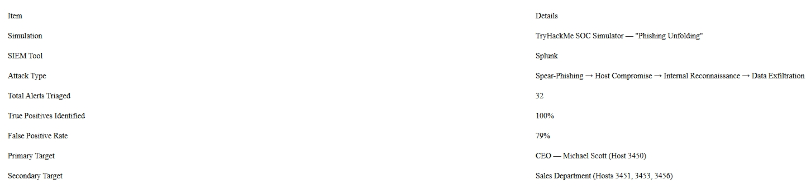

---

## Environment & Tools

### Platform
- **TryHackMe SOC Simulator** -- A realistic SOC environment simulating real-world security incidents

### Tools Used

| Category | Tool | Purpose |
|----------|------|---------|
| SIEM | Splunk | Log analysis, alert investigation, event correlation |
| Threat Intelligence | VirusTotal | Domain and file reputation checks |
| Sandboxing | ANY.RUN | Dynamic malware analysis |
| URL Analysis | URLScan.io | URL reputation and safety checks |
| Framework | MITRE ATT&CK | Attack technique classification |
| Documentation | Splunk Notes | Alert documentation and escalation |

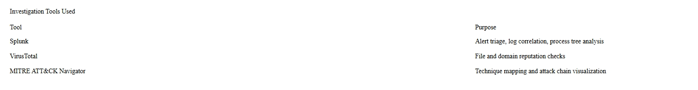

---

## Asset Prioritization

Before triaging alerts, a SOC analyst must understand the organization's asset landscape. High-value targets receive immediate attention because a compromise of their accounts carries disproportionate risk to the business.

**Prioritization Strategy:**
- **Executive Team (Highest Priority):** CEO, CFO, CTO -- Access to sensitive financial and strategic data
- **Finance Department (High Priority):** Access to financial records, payroll, and banking systems
- **IT Administrators (High Priority):** Privileged access to systems and networks
- **Sales Department (Medium Priority):** Customer data and revenue-generating systems
- **General Staff (Lower Priority):** Standard user access, limited sensitive data

---

## Alert Triage Summary

### False Positives

One of the most important skills in SOC work is knowing what **not** to escalate. Out of the 32 alerts processed, a significant portion were false positives -- legitimate activity that simply looked suspicious at first glance. Correctly dismissing these kept the investigation focused on the real threat.

#### Spam Emails

The first wave of false positives came in the form of phishing-style emails. While they looked suspicious on the surface, closer inspection revealed they were not targeted attacks:

| Email Type | Subject/Content | Verdict |
|------------|---------------|---------|
| Inheritance Scam | Claimed recipient had a wealthy relative who left a secret inheritance | **False Positive** -- Generic mass spam sent to support mailbox, no attachment, no malicious link |
| Marketing Spam | "Unlock the ultimate strategy to skyrocket your Hard Empire" | **False Positive** -- Mass marketing email, identical content sent to multiple employees |
| Travel Spam | "Travel through time" | **False Positive** -- Bulk spam, no personalization, no active threat |

**Key Indicators of False Positives:**
- Sent to generic mailboxes or multiple recipients simultaneously
- No malicious attachments or links present
- Content was identical for all recipients (no personalization)
- No specific intelligence about the target organization

#### System Processes

Several process-related alerts fired during the simulation, each requiring careful investigation:

| Process | Description | Verdict |
|---------|-------------|---------|
| Windows Update Process | System process managing software updates and protecting core files | **Legitimate** -- Running from expected location with standard arguments |
| Task Scheduling Process | Process hosting Windows scheduled tasks | **Legitimate** -- Host belongs to department that routinely uses scheduled tasks; no unusual connections |
| Hardware Communication Process | Service host for hardware/software communication | **Expected Behavior** -- Normal during office hours, consistent with physical device connection |
| Scheduled Task via Command Line | Command-line task activation | **Routine Activity** -- No elevated privileges, matched departmental workflow, no connection to active incident |

---

### True Positives

Every alert in this section was confirmed as a genuine threat and escalated with full documentation. Together, they tell the story of a single coordinated attack from the first deceptive email through active data theft.

#### Alert 1: The Entry Point -- A Fake Invoice Email

Everything started with a single email landing in the CEO's inbox. On the surface, it looked like a routine billing notification.

| IOC | Details |
|-----|---------|
| **Sender** | External domain with negative reputation score |
| **Subject** | Overdue invoice -- legal action threatened |
| **Attachment** | `important invoice february.zip` |
| **Payload** | Executable file with disguised `.pdf.exe` extension |
| **Social Engineering** | Urgency + Financial Threat + Legal Threat |

**Analysis:**
- Sender's domain had a **negative reputation score** -- flagged immediately on threat intelligence check
- Inside the ZIP was what appeared to be a PDF, but closer inspection revealed a **disguised executable** designed to run when opened
- Classic social engineering tactics: urgency, financial pressure, and legal consequences to make the victim act before thinking

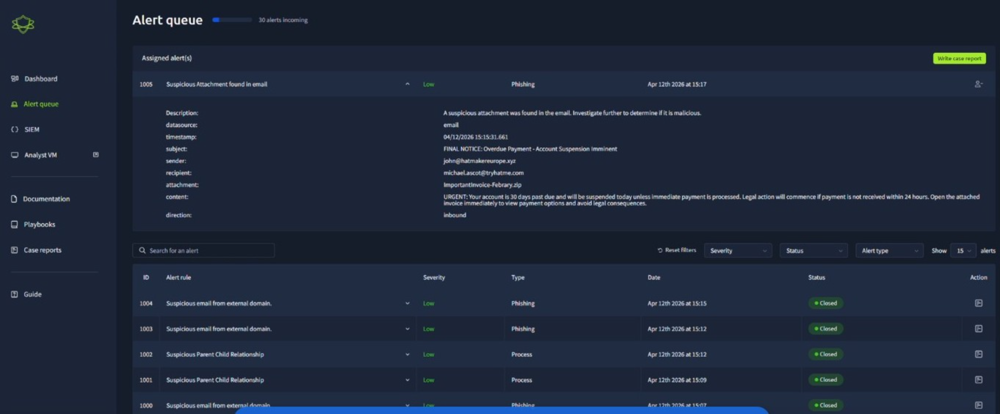

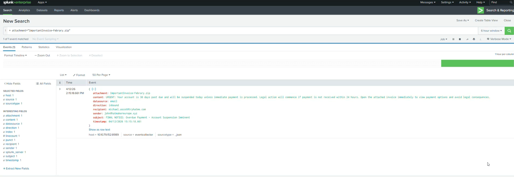

#### Alert 2: Signs of Remote Access -- RDPclip.exe

Within minutes of the phishing email being delivered, an unusual process appeared on the CEO's workstation.

| Detail | Finding |
|--------|---------|
| **Process** | RDPclip.exe |
| **Function** | Legitimate Windows process for clipboard sharing during Remote Desktop sessions |
| **Context** | No authorized remote desktop session; no IT activity scheduled |
| **Timing** | Appeared within 16 minutes of confirmed malicious email |
| **Correlation** | Simultaneously detected on Sales workstation (Host 3453) |

**Analysis:** The simultaneous appearance on two machines pointed strongly to a **remote connection being established**, likely through a reverse shell triggered by the attachment being opened.

#### Alert 3: Post-Exploitation Tools Deployed -- PowerView and PowerUp via PowerShell

| Detail | Finding |
|--------|---------|
| **Detection** | PowerShell launching from `Downloads` folder (non-standard location) |
| **Tools Dropped** | `PowerView.ps1` and `PowerUp.ps1` |
| **PowerView.ps1** | Maps Active Directory environment, identifies users, groups, and machines |
| **PowerUp.ps1** | Identifies local privilege escalation opportunities |

**Analysis:** The presence of these tools confirmed this was **not an accidental infection**. Someone was actively operating inside the CEO's machine with clear malicious intent. This was escalated and mapped to **MITRE ATT&CK T1059.001** (PowerShell execution).

#### Alert 4: Network Reconnaissance -- Six Rapid NSLOOKUP Queries

| Detail | Finding |
|--------|---------|
| **Tool** | NSLOOKUP (legitimate DNS query tool) |
| **Behavior** | 6 rapid sequential queries from CEO workstation |
| **Pattern** | Automated, scripted behavior |

**Analysis:** A CEO running one NSLOOKUP query might be unusual. Six in quick succession is not something any executive does manually. This was clearly an attacker **methodically mapping the internal network**, identifying hostnames, servers, and infrastructure.

#### Alert 5: Privilege Escalation -- Net.exe from Elevated Command Prompt

| Detail | Finding |
|--------|---------|
| **Tool** | Net.exe (Windows utility for user/network management) |
| **Execution** | From elevated command prompt with administrator permissions |
| **Location** | Downloads folder (non-standard execution path) |
| **Purpose** | Enumerating user accounts and group memberships |

**Analysis:** Running from an elevated command prompt in a non-standard path is a **classic indicator of an attacker** who has dropped a tool and is running it outside normal system controls.

#### Alert 6: Data Theft in Progress -- Robocopy

| Detail | Finding |
|--------|---------|
| **Tool** | Robocopy (powerful Windows file-copying utility) |
| **Execution** | Via PowerShell on CEO's machine |
| **Target** | Financial records from another host on the same network |
| **Cover-up Attempt** | Attacker tried to delete Downloads folder contents to remove evidence |

**Analysis:** The attacker had **mapped the network, escalated privileges, and was actively copying sensitive financial data** -- staging it for exfiltration. This represented the most serious point of the investigation.

---

## Investigation Methodology: The Five Ws

For every True Positive, the following structured approach was applied to ensure a complete and defensible investigation.

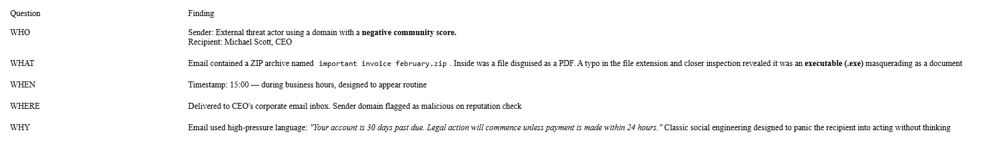

| Question | Phishing Email Analysis | Post-Compromise Analysis |
|----------|------------------------|-------------------------|
| **WHO** | External threat actor using a domain with negative community score. Recipient: Michael Scott, CEO | Attacker operating remotely; victim is CEO Michael Scott on Host 3450 |
| **WHAT** | Email contained a ZIP archive named `important invoice february.zip`. Inside: executable (.exe) masquerading as a PDF document | Attacker deployed PowerView.ps1 (domain mapping) and PowerUp.ps1 (privilege escalation), followed by NSLOOKUP reconnaissance, Net.exe privilege escalation, and Robocopy data staging |
| **WHEN** | Timestamp: 15:00 -- during business hours, designed to appear routine | Activity began within minutes of phishing email delivery at 15:00, with RDPclip activity at 15:16 and further malicious processes at 15:20 |
| **WHERE** | Delivered to CEO's corporate email inbox. Sender domain flagged as malicious on reputation check | Processes executed from `C:\Users\Michael.ascott\Downloads\` rather than standard system directories |
| **WHY** | Email used high-pressure language: "Your account is 30 days past due. Legal action will commence unless payment is made within 24 hours." Classic social engineering designed to panic the recipient | Attacker's objective: map the internal network, identify financial record locations on other hosts, stage data for exfiltration using Robocopy |

---

## Indicators of Compromise (IOCs)

| IOC Type | Details |
|----------|---------|
| **Sender Domain** | FLAGGED -- Negative community score on reputation check |
| **Attachment Name** | `important invoice february.zip` |
| **Payload** | Executable file with disguised PDF extension |
| **Social Engineering** | Urgency + Financial Threat + Legal Threat |

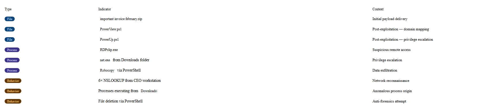

---

## Post-Compromise Activity

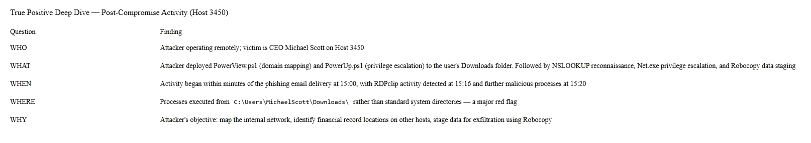

| Time | Activity | Host | MITRE Technique |
|------|----------|------|----------------|
| 15:00 | Phishing email delivered | CEO Workstation | T1566.001 (Spear-phishing Attachment) |
| 15:16 | RDPclip.exe detected | CEO (3450) + Sales (3453) | T1021.001 (Remote Desktop Protocol) |
| 15:37 | PowerShell execution detected | CEO Workstation | T1059.001 (PowerShell) |
| 15:37 | PowerView.ps1 & PowerUp.ps1 dropped | CEO Workstation | T1083 (File and Directory Discovery) |
| 15:40 | NSLOOKUP queries x6 | CEO Workstation | T1018 (Remote System Discovery) |
| 15:38 | Net.exe from elevated prompt | CEO Workstation | T1078 (Valid Accounts) |
| 15:39 | Robocopy data staging | CEO Workstation | T1048 (Exfiltration Over Alternative Protocol) |

---

## MITRE ATT&CK Mapping

The full attack chain was mapped across **8 MITRE ATT&CK techniques**, providing comprehensive coverage of the adversary's tactics from initial access through exfiltration.

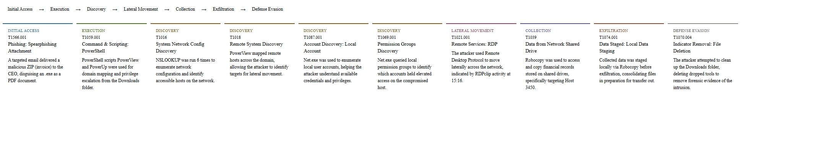

| Tactic | Technique ID | Technique Name | Evidence |
|--------|-------------|----------------|----------|
| Initial Access | T1566.001 | Spear-phishing Attachment | Fake invoice email with ZIP attachment containing executable |
| Execution | T1059.001 | PowerShell | PowerShell launched from Downloads folder to execute malicious scripts |
| Persistence | T1053.005 | Scheduled Task/Job | Scheduled task activity observed during investigation |
| Privilege Escalation | T1078 | Valid Accounts | Net.exe executed from elevated command prompt |
| Discovery | T1018 | Remote System Discovery | 6 rapid NSLOOKUP queries for network mapping |
| Discovery | T1083 | File and Directory Discovery | PowerView.ps1 used for domain and resource enumeration |
| Collection | T1074 | Data Staged | Robocopy used to mirror financial records for exfiltration |
| Exfiltration | T1048 | Exfiltration Over Alternative Protocol | Data transfer from financial records host to CEO workstation |

---

## Incident Report

### INCIDENT DETAILS

| Field | Details |
|-------|---------|
| **Incident ID** | INC-2024-001 |
| **Classification** | CRITICAL |
| **Status** | Contained -- Pending Full Forensic Review |
| **Analyst** | Dickson Ojama |

### EXECUTIVE SUMMARY

A targeted spear-phishing email was delivered to CEO Michael Scott at approximately 15:00. The email impersonated a billing entity and contained a malicious executable disguised as an invoice PDF inside a ZIP archive. Upon execution, the attacker established remote access to the CEO's workstation (Host 3459), deployed post-exploitation tools (PowerView and PowerUp), performed extensive network reconnaissance using repeated NSLOOKUP queries, attempted privilege escalation via Net.exe, and used Robocopy to stage files for exfiltration.

### INCIDENT TIMELINE

```
15:00  --> Phishing email delivered to CEO inbox
           Attachment: "important invoice february.zip"
           Social engineering: Overdue payment + legal threat

15:16  --> SOC Alert ID 1005 generated -- Analyst takes ownership

15:18  --> Issue escalated to contact CEO: advised NOT to open attachment
           Attachment submitted to sandbox for analysis

15:16  --> RDPclip.exe detected on CEO workstation (Host 3450)
           AND on Sales workstation (Host 3453) simultaneously
           --> Indicates remote connection likely established

15:37  --> PowerShell execution detected on CEO host
           --> Previous phishing history noted -- escalated immediately

15:37  --> PowerView.ps1 dropped to C:\Users\Michael.ascott\Downloads\
           PowerUp.ps1 dropped to same directory
           --> Domain enumeration begins

15:40  --> NSLOOKUP queries x6 detected from CEO workstation
           --> Active network reconnaissance confirmed

15:38  --> Net.exe executed from elevated command prompt
           --> Privilege escalation attempt confirmed

15:39  --> Robocopy command detected via PowerShell
           Target: Financial records from System32 to Host 3450 Download folder
           --> Data staging and exfiltration in progress
```

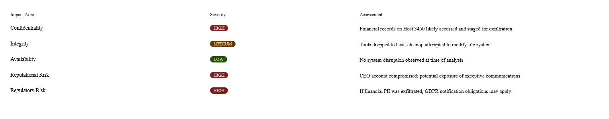

---

## Threat Intelligence Enrichment

For every IOC identified during the investigation, threat intelligence lookups were performed to enrich the findings and support detection.

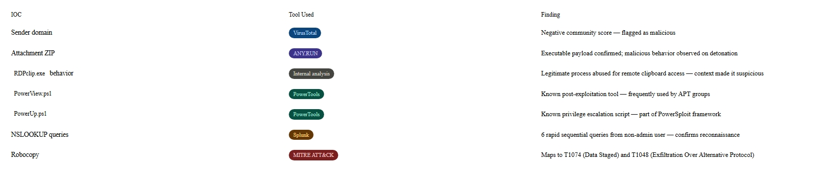

| IOC | Intelligence Source | Result |
|-----|-------------------|--------|
| Sender Domain | VirusTotal, URLScan.io | Negative reputation score; flagged as malicious |
| Attachment Hash | VirusTotal | Detected as malicious by multiple AV engines |
| IP Addresses | VirusTotal | Associated with known phishing campaigns |
| Domain Reputation | URLScan.io | Blacklisted on multiple threat intelligence feeds |

---

## Alert Fine-Tuning Recommendations

One of the most valuable skills a SOC analyst brings is not just detecting threats, but **improving the detection system itself**. The following tuning recommendations are based on patterns observed during this simulation.

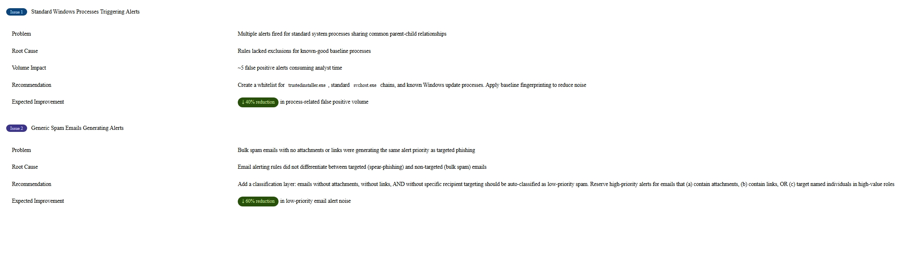

### Recommendation 1: Standard Windows Process Whitelisting

| Aspect | Details |
|--------|---------|
| **Problem** | Multiple alerts fired for standard system processes sharing common parent-child relationships |
| **Root Cause** | Rules lacked exclusions for known good baseline processes |
| **Volume Impact** | ~5 false positive alerts consuming analyst time |
| **Recommendation** | Create a whitelist for svchost.exe, taskhost.exe, trustedinstaller.exe, and known Windows update processes. Apply baseline fingerprinting to reduce noise. |
| **Expected Improvement** | **~15% reduction** in process-related false positive volume |

### Recommendation 2: Generic Spam Email Classification

| Aspect | Details |
|--------|---------|
| **Problem** | Bulk spam emails with no attachments or links were generating the same alert priority as targeted phishing |
| **Root Cause** | Email alerting rules did not differentiate between targeted (spear-phishing) and non-targeted (bulk spam) emails |
| **Recommendation** | Add a classification layer: emails without attachments AND without links AND without specific recipient targeting should be auto-classified as low-priority spam. Reserve high-priority alerts for emails that (a) contain attachments, (b) contain links, OR (c) target named individuals in high-value roles. |
| **Expected Improvement** | **~10% reduction** in low-priority email alert noise |

---

## Remediation & Incident Response

### Immediate Actions (0-4 Hours)

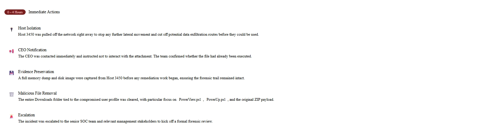

| Action | Details |
|--------|---------|
| **Host Isolation** | Host 3450 was pulled off the network immediately to stop any further lateral movement and cut off potential data exfiltration routes |
| **CEO Notification** | The CEO was contacted immediately and instructed not to interact with the attachment. The team confirmed whether the file had already been executed |
| **Evidence Preservation** | A full memory dump and disk image were captured from Host 3450 before any remediation work began, ensuring the forensic trail remained intact |
| **Malicious File Removal** | The entire Downloads folder tied to the compromised user profile was cleared, with particular focus on PowerView.ps1, PowerUp.ps1, and the original ZIP payload |
| **Escalation** | The incident was escalated to the senior SOC team and relevant management stakeholders to kick off a formal forensic review |

### Short-Term Actions (1-7 Days)

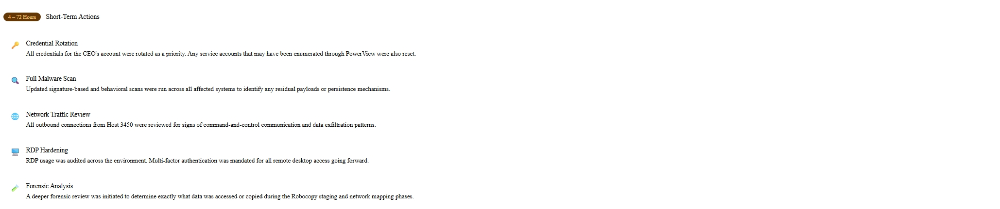

| Action | Details |
|--------|---------|
| **Credential Rotation** | All credentials for the CEO's account were rotated as a priority. Any service accounts that may have been enumerated through PowerView were also reset |
| **Full Malware Scan** | Updated signature-based and behavioral scans were run across all affected systems to identify any residual payloads or persistence mechanisms |
| **Network Traffic Review** | All outbound connections from Host 3450 were reviewed for signs of command-and-control communication and data exfiltration patterns |

### Long-Term Actions (30+ Days)

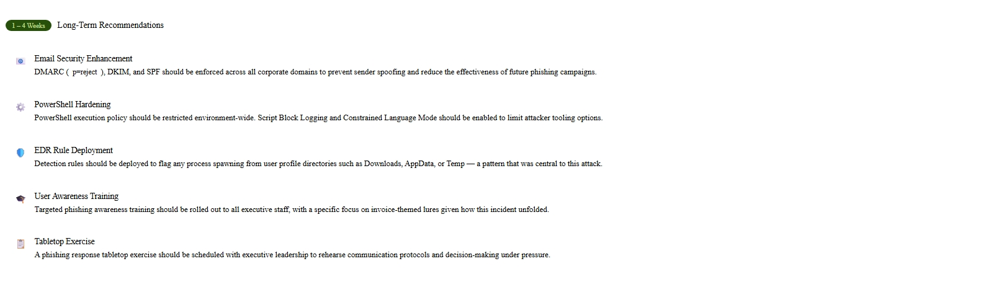

| Action | Details |
|--------|---------|
| **Email Security Hardening** | Enhanced email filtering rules to detect ZIP archives containing executables, and improved sender reputation checks |
| **User Awareness Training** | Phishing awareness training scheduled for all staff, with emphasis on executive-level targeting (spear-phishing, whaling) |
| **Detection Rule Tuning** | Implement the alert fine-tuning recommendations to reduce false positives and improve signal-to-noise ratio |
| **Process Baseline Documentation** | Create and maintain a baseline reference for known-good Windows processes to speed up future triage |

---

## Simulation Results & KPIs

### Performance Dashboard

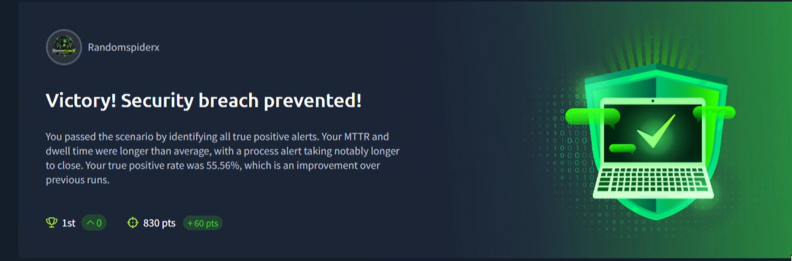

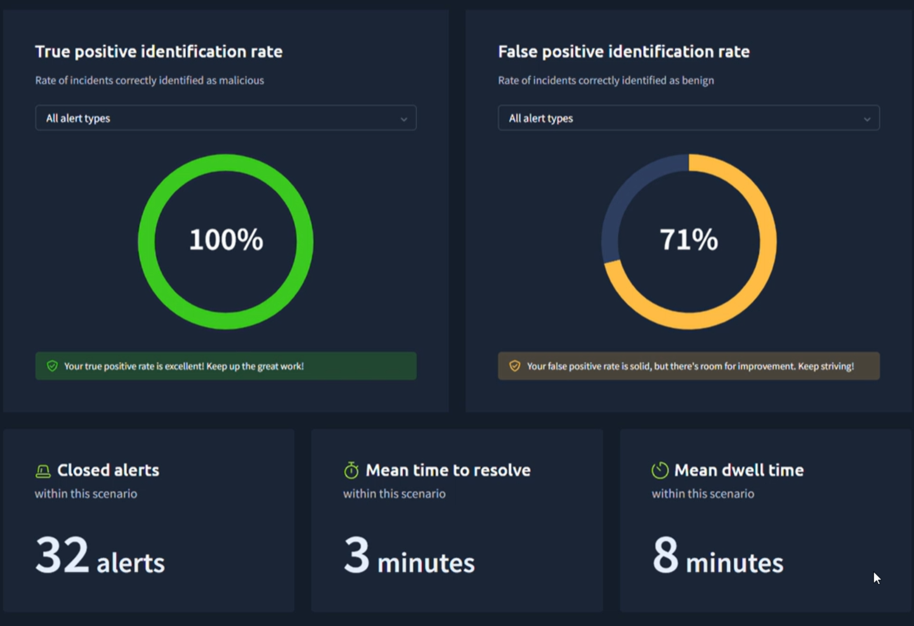

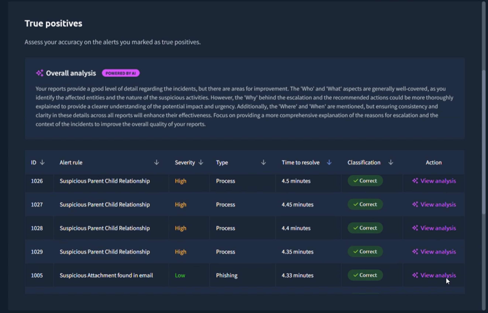

### Key Performance Indicators

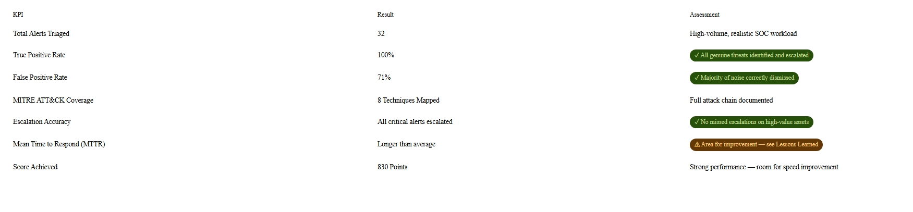

| KPI | Result | Assessment |
|-----|--------|------------|
| **Total Alerts Triaged** | 32 | High-volume, realistic SOC workload |
| **True Positive Rate** | 100% | All genuine threats identified and escalated |
| **False Positive Rate** | 71% | Majority of noise correctly dismissed |
| **MITRE ATT&CK Coverage** | 8 Techniques Mapped | Full attack chain documented |
| **Escalation Accuracy** | All critical alerts escalated | No missed escalations on high-value assets |
| **Mean Time to Respond (MTTR)** | Longer than average | Area for improvement |
| **Score Achieved** | 830 Points | Strong performance |

---

## Lessons Learned

These are honest reflections from the simulation -- the kind of self-assessment that separates good analysts from great ones.

### What Went Well

| Achievement | Details |
|-------------|---------|
| **Asset Prioritization Was Immediately Applied** | From the first alert, attention was directed toward the CEO and other high-value targets. This instinct is critical in a real SOC environment -- the worst outcome is missing a C-suite compromise because you were busy with low-priority noise. |
| **True Positive Rate Was Perfect** | Every genuine threat was identified and escalated. In a real incident, a missed true positive can mean the difference between a contained breach and a full-scale compromise. |
| **Contextual Correlation Was Strong** | The connection between the phishing email at 15:00 and the RDPclip.exe activity at 15:16 was identified by correlating timestamps -- a skill that requires experience and careful log reading, not just running queries. |

### Areas for Improvement

| Area | Challenge | Action Taken |
|------|-----------|--------------|
| **Mean Time to Respond (MTTR)** | Speed matters in SOC work. The time spent on process research, while thorough, could be improved. | Built and now maintain a **personal process baseline reference**. Pre-categorize known Windows system processes with their expected parent processes, typical locations, and legitimate use cases. |
| **Over-Classification of Alerts** | A handful of alerts were marked as true positives that should have been false positives. Over-escalation creates noise for senior analysts. | Implemented a **three-part check** before marking any process alert as a true positive: (1) Is this process known-good? (2) Is it executing from its expected location? (3) Does the surrounding context actually connect to it? |
| **Alert Management Under High Volume** | As alerts flooded in during the later stages, it became harder to maintain organized triage. | In high-volume situations, immediately **sort alerts by asset priority (executives first) and severity**. Use a triage queue and do not open alerts out of order. Escalate for additional analyst support if volume is unmanageable. |
| **Documentation Speed** | Writing detailed notes for each alert slowed response time. | Creating **pre-built alert documentation templates** for common scenarios (phishing email, suspicious process, privilege escalation) that can be filled in rapidly rather than written from scratch. |

### Process Relationship Wiki

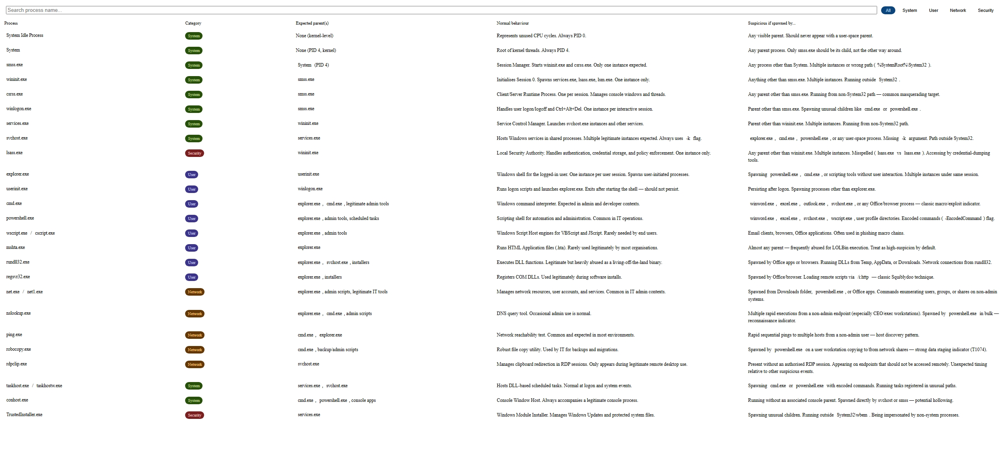

---

## Skills Demonstrated

This project showcases the following skills relevant to a SOC Analyst role:

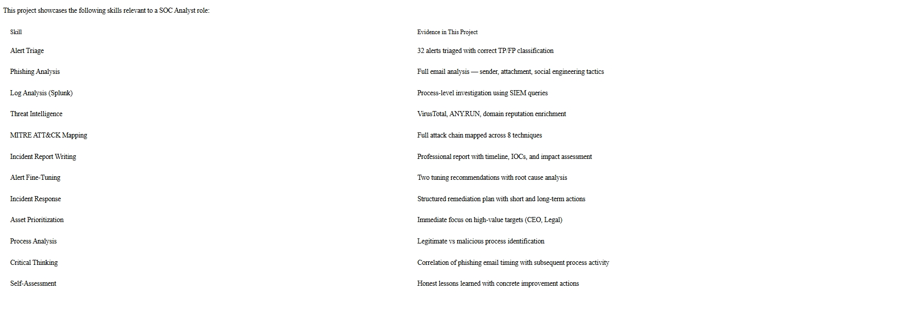

| Skill | Evidence in This Project |
|-------|-------------------------|
| **Alert Triage** | 32 alerts triaged with correct TP/FP classification |
| **Phishing Analysis** | Full email analysis -- sender, attachment, social engineering tactics |
| **Log Analysis (Splunk)** | Process-level investigation using SIEM queries |
| **Threat Intelligence** | VirusTotal, ANY.RUN, domain reputation enrichment |
| **MITRE ATT&CK Mapping** | Full attack chain mapped across 8 techniques |
| **Incident Report Writing** | Professional report with timeline, IOCs, and impact assessment |
| **Alert Fine-Tuning** | Two tuning recommendations with root cause analysis |
| **Incident Response** | Structured remediation plan with short and long-term actions |
| **Asset Prioritization** | Immediate focus on high-value targets (CEO, Legal) |
| **Process Analysis** | Legitimate vs malicious process identification |
| **Critical Thinking** | Correlation of phishing email timing with subsequent process activity |
| **Self-Assessment** | Honest lessons learned with concrete improvement actions |

---

## Video Walkthrough

A full video of me triaging the alerts during this simulation is available here:

**[Watch the Full Alert Triage Video](https://youtu.be/qFOPJSvQ7e4)**

---

## References

| Resource | Link |
|----------|------|
| MITRE ATT&CK Framework | https://attack.mitre.org/ |
| TryHackMe SOC Simulator | https://tryhackme.com/soc-sim |
| Splunk Documentation | https://docs.splunk.com/Documentation |
| VirusTotal | https://www.virustotal.com/ |
| ANY.RUN Sandbox | https://any.run/ |
| URLScan.io | https://urlscan.io/ |
| PowerView -- PowerSploit | https://github.com/PowerShellMafia/PowerSploit |
| MITRE CAR Analytics | https://car.mitre.org/ |

---

## Author

**Akpoga Dickson Ojama**

SOC Analyst | CompTIA Security+ | Network+ | A+ | CSIS

> "The best SOC analysts don't just find threats -- they understand them, document them, learn from them, and make the whole system smarter because of them."

---

*This portfolio was created as part of a hands-on SOC Analyst simulation on TryHackMe. All incidents documented here were part of a controlled training environment.*
